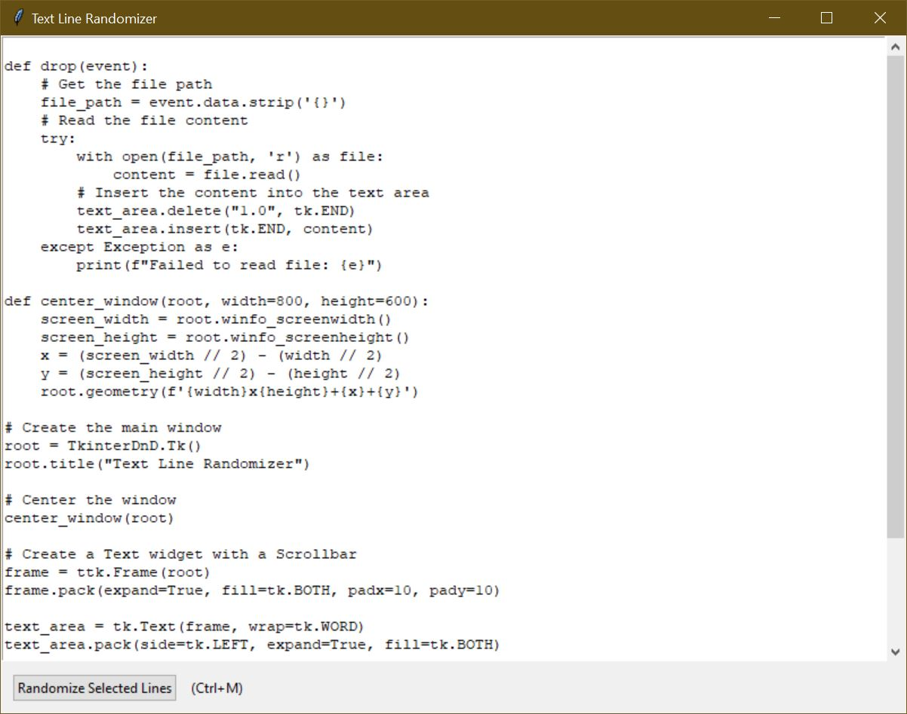
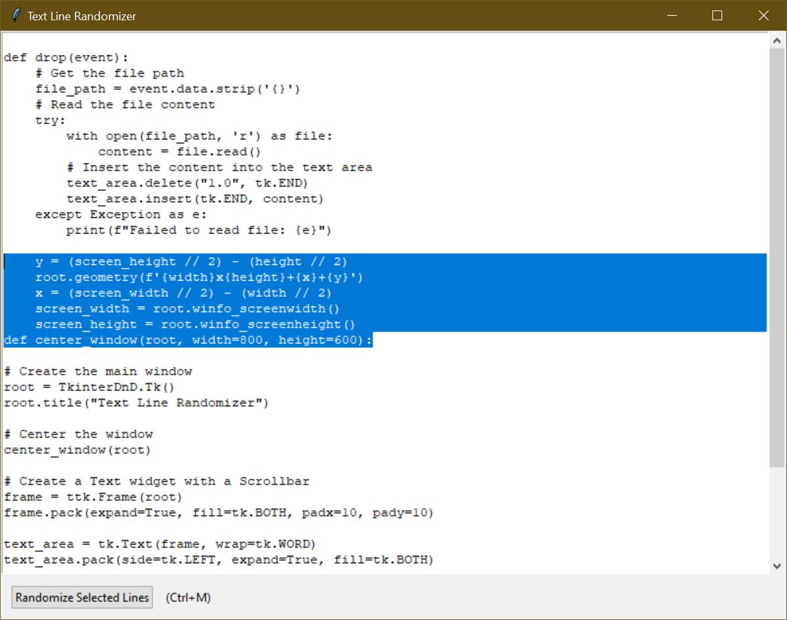

# Text Line Randomizer




## Description

This is a simple text line randomizer application built using Python's Tkinter library. It allows you to randomize lines of text from either selected text or the entire text in the text area. The application also supports drag-and-drop functionality to load text files directly into the text area.

## Features

- **Randomize Selected Lines:** Randomize lines within the selected text.
- **Randomize All Lines:** If no text is selected, it will randomize all the lines in the text area.
- **Drag and Drop Support:** Load text files by dragging and dropping them into the text area.
- **Hotkey Support:** Use the `Ctrl+M` shortcut to randomize the text.

## Installation

1. Clone the repository:
    ```sh
    git clone https://github.com/yourusername/text-line-randomizer.git
    cd text-line-randomizer
    ```

2. Install the required dependencies:
    ```sh
    pip install tkinterdnd2
    ```

## Usage

1. Run the application:
    ```sh
    python main.py
    ```

2. **Randomize Selected Lines:**
   - Select the lines you want to randomize.
   - Click the "Randomize Selected Lines" button or press `Ctrl+M`.

3. **Drag and Drop:**
   - Drag a text file and drop it into the text area to load its content.
